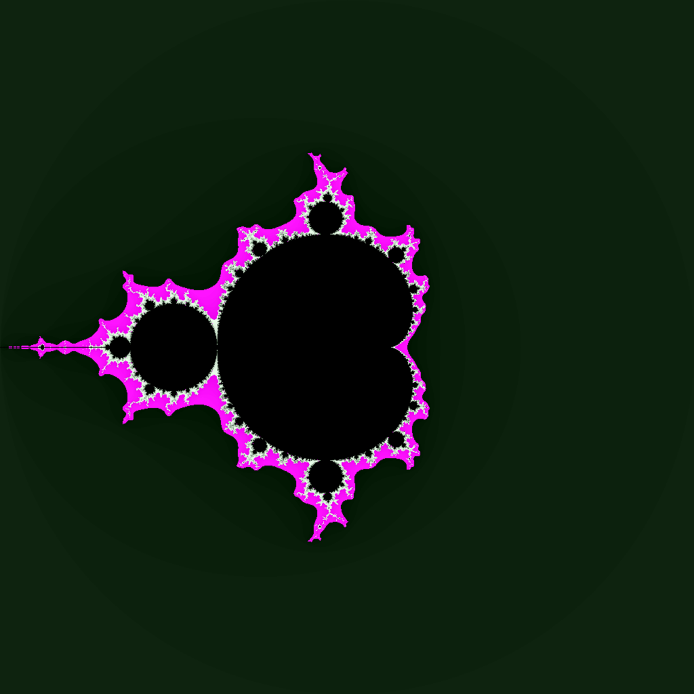

# Mandelbrot

The term Mandelbrot set is used to refer both to a general class of fractal sets and to a particular instance of such a set.
The Mandelbrot set is the set obtained from the quadratic recurrence equation

Recursive formula 

<p align="center">
  
</p>

Learn more:

https://en.wikipedia.org/wiki/Mandelbrot_set

You start with a specific number, and then you apply the same recursive formula, again and again, to get the next number in the sequence.


## Demo
<p align="center">
  </a>
</p>


## Build

To generate fractal image 

```bash
  go run mandelbrot.go > fractal.png
```
